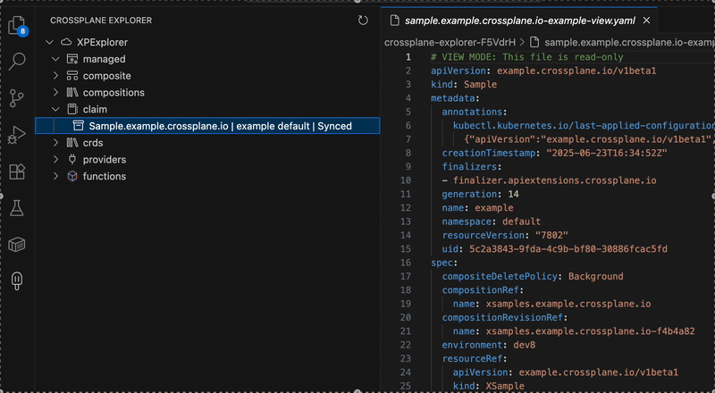
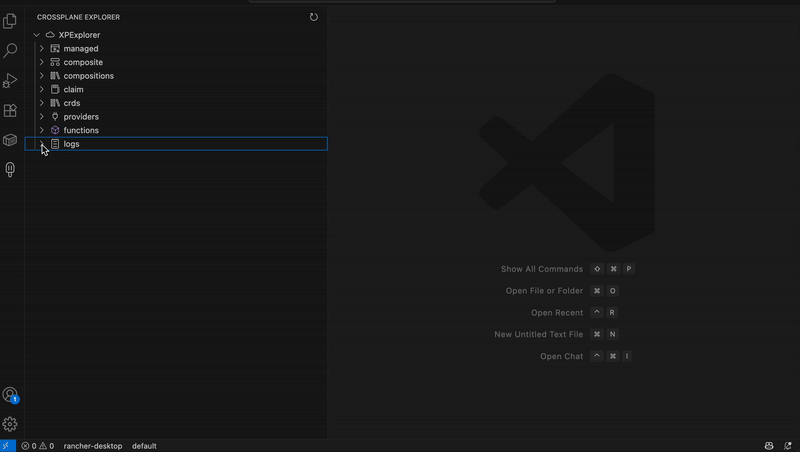

# Crossplane Explorer

A Visual Studio Code extension to view, edit, and manage Crossplane resources in your Kubernetes cluster.

## Features

- **Tree View of Crossplane Resources**: Browse managed resources, composites, claims, compositions, CRDs, providers, and functions in a dedicated sidebar.
- **YAML Editing**: Click any resource to open its YAML in a real file. Edit and save to apply changes directly to your cluster (like `kubectl edit`).
- **Status at a Glance**: See resource health and sync status right in the explorer.
- **One-Click Refresh**: Instantly refresh the resource list with the refresh button.
- **Beautiful Icons**: Each resource type has a clear, modern icon for easy navigation.

## Viewing and Editing Resources

- **Single-click** any resource to open its YAML in **read-only mode**. This view includes the full resource, including the `status` field, and is clearly marked with a banner at the top:
  ```yaml
  # VIEW MODE: This file is read-only
  ...
  ```
- To **edit** a resource, **right-click** and select **Edit Resource YAML**. This opens the YAML in editable mode (with status and managed fields removed), and a banner at the top indicates:
  ```yaml
  # EDIT MODE: You can edit and apply changes to this resource
  ...
  ```
- Only one tab per resource is open at a time—switching between view and edit will close the other mode's tab automatically.

## Example: Tree View and YAML Editing

Below is an example of the Crossplane Explorer tree view and editing a resource's YAML:



## Logs: View and Watch Pod Logs

You can now view and watch logs for Crossplane, provider, and function pods directly from the explorer:

- Expand the **logs** section to see Crossplane, provider, and function pods.
- **Single-click** a pod to view its YAML in read-only mode.
- **Right-click** a pod and select **Watch Log** to stream its logs (`kubectl logs -f ...`) in a VSCode output channel.

Below is an example of the logs feature in action:



## Performance & Safety: Exclude Core CRDs

To improve performance and reduce clutter, the extension allows you to exclude CRDs whose names end with certain suffixes (such as `crossplane.io`, `upbound.io`, `cattle.io`). This also helps prevent accidental editing of critical Crossplane, Upbound, or Rancher (cattle) CRDs.

You can configure the excluded suffixes in your VS Code settings:

- **Settings UI:**
  1. Open Command Palette (`Cmd+Shift+P`/`Ctrl+Shift+P`), type `Preferences: Open Settings (UI)`.
  2. Search for `Crossplane Explorer`.
  3. Edit **CRD Suffixes to Exclude from the CRD List**.

- **settings.json:**
  ```json
  "crossplaneExplorer.excludeCrdSuffixes": [
    "crossplane.io",
    "upbound.io",
    "cattle.io"
  ]
  ```

By default, these suffixes are excluded. You can customize this list to fit your needs.

## Requirements

- [VS Code](https://code.visualstudio.com/)
- [kubectl](https://kubernetes.io/docs/tasks/tools/) installed and configured to access your Kubernetes cluster
- [Crossplane](https://crossplane.io/) installed in your cluster

## Usage

1. Open the **Crossplane Explorer** from the activity bar.
2. Expand categories to see your Crossplane resources.
3. Click any resource to view and edit its YAML. Save to apply changes directly to the cluster.
4. Use the refresh button to update the view.

## Known Issues
- Editing very large resources may be slow due to cluster/network latency.
- Only one editor tab per resource is supported; clicking again focuses the existing tab.

## Release Notes

### 0.0.1
- Initial release: resource browsing, YAML editing, status display, and more.

---

**Maintainer:** vinish soman

For issues or feature requests, please open an issue on the project repository.
