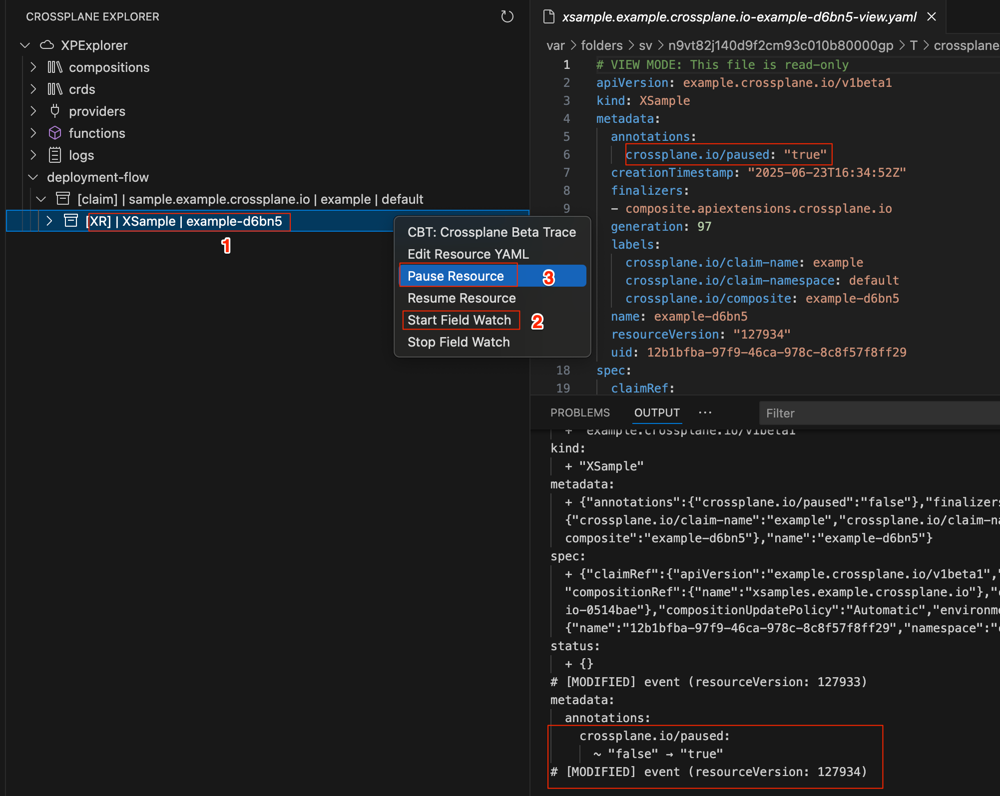
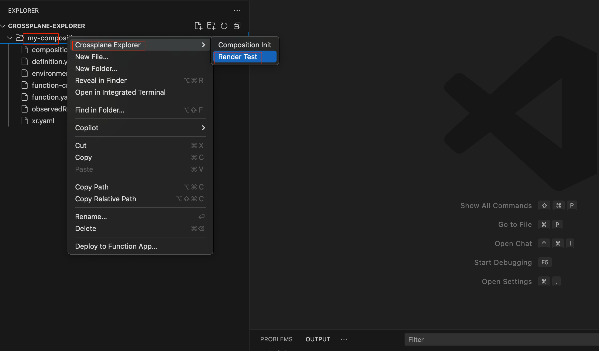

# Crossplane Explorer

A Visual Studio Code extension to view, edit, and manage Crossplane resources in your Kubernetes cluster.

## Features

- **Tree View of Crossplane Resources**: Browse managed resources, composites, claims, compositions, CRDs, providers, and functions in a dedicated sidebar.
- **YAML Editing**: Click any resource to open its YAML in a real file. Edit and save to apply changes directly to your cluster (like `kubectl edit`).
- **Status at a Glance**: See resource health and sync status right in the explorer.
- **One-Click Refresh**: Instantly refresh the resource list with the refresh button.
- **Beautiful Icons**: Each resource type has a clear, modern icon for easy navigation.
- **CBT/Trace on XR**: Right-click any XR (composite resource) under deployment-flow and select **CBT** to run `crossplane beta trace` and view XR status in a tabular format in the Output panel.
- **Field Watch (Real-Time Diff)**: Right-click any XR or MR under deployment-flow and select **Start Field Watch** to see real-time, field-level diffs for resource changes. You can also select **Stop Field Watch** to stop watching that resource. Both options are always available in the context menu, and you can run multiple Field Watches concurrently. The extension will handle duplicate start/stop requests gracefully. Powered by the Kubernetes JS client, this feature shows a clean, YAML-like diff output for every change, with no off-by-one or noisy metadata. Only meaningful changes are shown, making it easy to track resource evolution live.
- **Pause/Resume XR and MR**: Right-click any XR or MR and select **Pause Resource** to add the annotation `crossplane.io/paused=true`, pausing reconciliation for that resource. Select **Resume Resource** to set the annotation to `crossplane.io/paused=false`, resuming reconciliation. The extension checks for permissions and verifies that the annotation was applied. If you do not have permission or the annotation was not applied, you will see a clear error or warning message. This feature is idempotent and always sets the annotation to the desired value.
- **Start/Stop Pod Log Watch:** Dedicated Start (▶️) and Stop (⏹️) buttons are now available for watching pod logs. You can start a log watch for any pod and stop it at any time directly from the context menu or UI, making log monitoring more convenient and manageable.
- View and manage Crossplane resources (Claims, XRs, MRs, Providers, Functions, CRDs, Compositions, Configurations, DeploymentRuntimeConfigs) in a tree view

## Deployment Tree Structure: claim > XR > MR

The **deployment-flow** view implements a hierarchical tree structure for Crossplane resources:

- **Claim**: At the top level, each claim node represents a user-facing resource claim.
- **XR (Composite Resource)**: Expanding a claim node shows all top-level composite resources (XRs) that reference the claim.
- **MR (Managed Resource)**: Expanding an XR node shows its child composite resources and managed resources (MRs), reflecting the full lineage and relationships.

This structure makes it easy to visualize and navigate the relationships between claims, composite resources, and managed resources in your Crossplane environment.

## Example: Tree View, YAML Editing, and Watch Log

The following demo shows how you can browse resources, edit YAML, and watch pod logs in Crossplane Explorer:


## Viewing and Editing Resources

- **Single-click** any resource to open its YAML in **read-only mode**. This view includes the full resource, including the `status` field, and is clearly marked with a banner at the top:
  ```yaml
  # VIEW MODE: This file is read-only
  ...
  ```
- To **edit** a resource, **right-click** and select **Edit Resource YAML**. This opens the YAML in editable mode (with status and managed fields removed), and a banner at the top indicates:
  ```yaml
  # EDIT MODE: You can edit and apply changes to this resource
  ...
  ```
- Only one tab per resource is open at a time—switching between view and edit will close the other mode's tab automatically.

## Logs: View and Watch Pod Logs

You can now view and watch logs for Crossplane, provider, and function pods directly from the explorer:

- Expand the **logs** section to see Crossplane, provider, and function pods.
- **Single-click** a pod to view its YAML in read-only mode.
- **Right-click** a pod and select **Watch Log** to stream its logs (`kubectl logs -f ...`) in a VSCode output channel.

## Pause/Resume and Field Watch Example

Below is a screenshot showing the **Pause/Resume** and **Field Watch (Real-Time Diff)** features in action for XR and MR nodes:



*The screenshot demonstrates how you can right-click any XR or MR to pause/resume reconciliation or start/stop Field Watch for real-time diffs.*

### Configurations
The **Configurations** node lists all Crossplane configuration packages installed in your cluster. You can expand this node to see each configuration and view its YAML details.

### DeploymentRuntimeConfigs
The **DeploymentRuntimeConfigs** node displays all deployment runtime configuration resources. These are used to configure runtime settings for Crossplane deployments. You can expand this node to see each config and view its YAML details.

## Composition Init & Render Test (Ultra-Fast Composition Prototyping)

Crossplane Explorer makes it ultra-fast and convenient to create and test Crossplane composition skeletons directly from the VSCode File Explorer:

- **Composition Init**: Right-click any folder and select **Crossplane Explorer → Composition Init** to instantly scaffold a set of starter files for Crossplane composition development:
  - `composition.yaml`
  - `definition.yaml`
  - `function.yaml`
  - `xr.yaml`
  - `observedResources.yaml`
  - `environmentConfig.json`
  - `function-creds.yaml`

  

- **Render Test**: After editing your skeleton files, right-click the same folder and select **Crossplane Explorer → Render Test**. This will run a local render using the Crossplane CLI:

  ```sh
  crossplane render xr.yaml composition.yaml function.yaml --observed-resources=observedResources.yaml --context-files apiextensions.crossplane.io/environment=environmentConfig.json --function-credentials=function-creds.yaml
  ```

  - If the render is successful, the output is saved as `renderResult.yaml` in the same folder.
  - If it fails, an error message is shown in the Output Console and as a notification.
  - **Do not rename any of the generated files**—the Render Test depends on these exact filenames.
  - **Dependency:** Docker must be running on your host machine for the Render Test feature to work (required by the Crossplane CLI).

  

### Why use these features?
- **Ultra-fast prototyping**: Create a working composition skeleton and test it in seconds, with just a few clicks.
- **Confidence before deployment**: The Render Test acts as a unit test for your composition logic—if it passes, you know your composition is valid and ready for further development or deployment.
- **Convenient workflow**: All actions are available at the folder level via right-click, making it easy to iterate and experiment.

---

## Performance & Safety: Exclude Core CRDs

To improve performance and reduce clutter, the extension allows you to exclude CRDs whose names end with certain suffixes (such as `crossplane.io`, `upbound.io`, `cattle.io`). This also helps prevent accidental editing of critical Crossplane, Upbound, or Rancher (cattle) CRDs.

You can configure the excluded suffixes in your VS Code settings:

- **Settings UI:**
  1. Open Command Palette (`Cmd+Shift+P`/`Ctrl+Shift+P`), type `Preferences: Open Settings (UI)`.
  2. Search for `Crossplane Explorer`.
  3. Edit **CRD Suffixes to Exclude from the CRD List**.

- **settings.json:**
  ```json
  "crossplaneExplorer.excludeCrdSuffixes": [
    "crossplane.io",
    "upbound.io",
    "cattle.io"
  ]
  ```

By default, these suffixes are excluded. You can customize this list to fit your needs.

## Requirements

- [VS Code](https://code.visualstudio.com/)
- [kubectl](https://kubernetes.io/docs/tasks/tools/) installed and configured to access your Kubernetes cluster
- [Crossplane](https://crossplane.io/) installed in your cluster
- [Crossplane CLI](https://docs.crossplane.io/latest/getting-started/cli/) installed (required for CBT/trace feature)

## Usage

1. Open the **Crossplane Explorer** from the activity bar.
2. Expand categories to see your Crossplane resources.
3. Click any resource to view and edit its YAML. Save to apply changes directly to the cluster.
4. Use the refresh button to update the view.

## Known Issues
- Editing very large resources may be slow due to cluster/network latency.
- Only one editor tab per resource is supported; clicking again focuses the existing tab.

### Field Watch Example

```
# [MODIFIED] event (resourceVersion: 99055)
spec:
  environment:
    ~ "dev111" → "dev112"
```

## Release Notes

### 0.0.35
- Initial release: resource browsing, YAML editing, status display, and more.

---

**Maintainer:** vinish soman

For issues or feature requests, please open an issue on the project repository.
