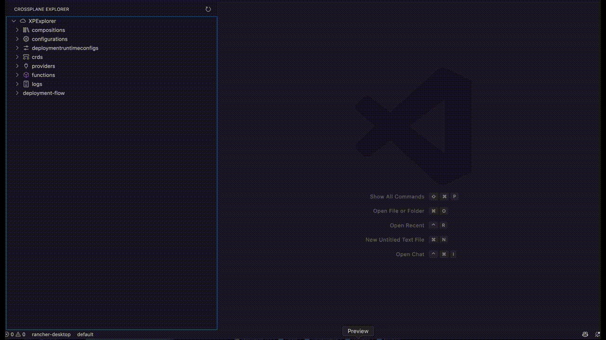
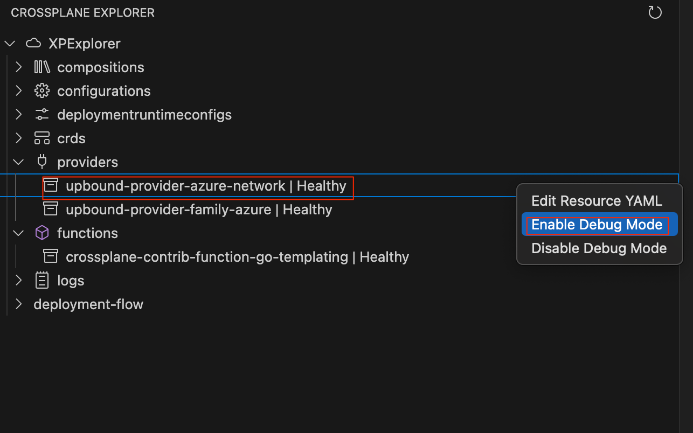
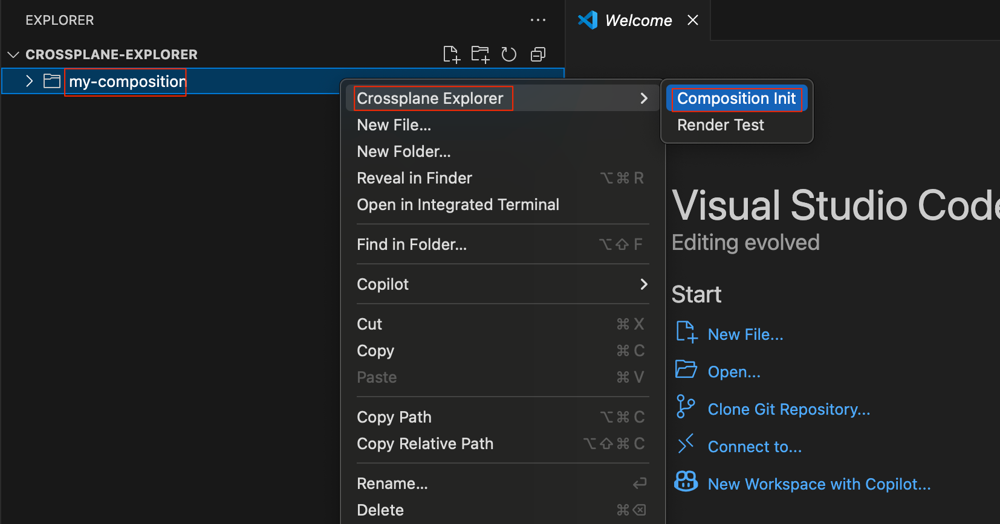
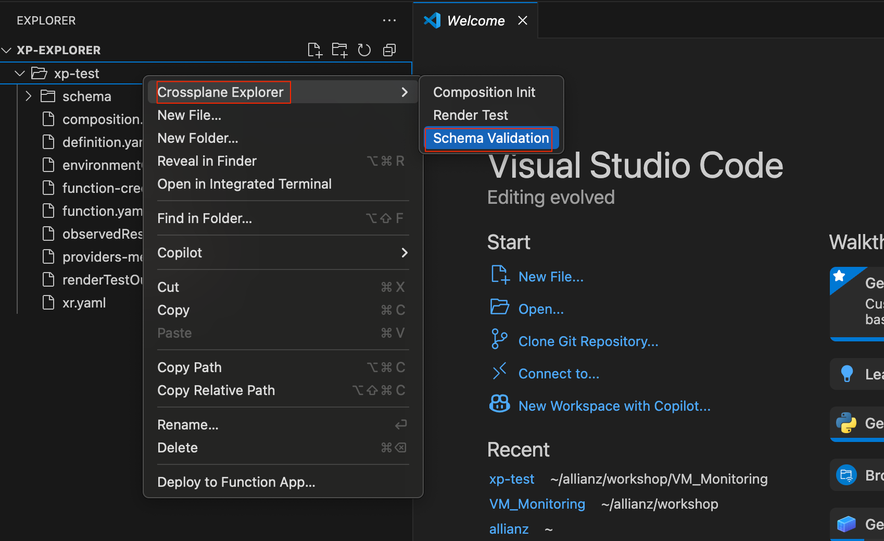
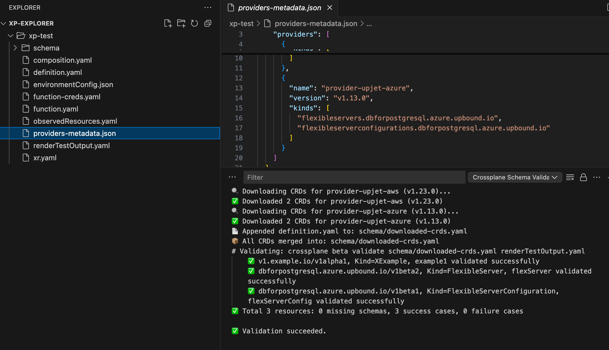

# Crossplane Explorer

A Visual Studio Code extension to view, edit, and manage Crossplane resources in your Kubernetes cluster.

## Features

- **Tree View of Crossplane Resources**: Browse managed resources, composites, claims, compositions, XRDs (CompositeResourceDefinitions), providers, and functions in a dedicated sidebar.
- **Performance Panel (Live Metrics)**: The **Performance** panel provides live usage metrics for Crossplane pods (CPU, memory, and more) and lets you compare them with cluster node CPU usage. This gives you a fair idea of how much resource Crossplane is utilizing relative to your cluster, helping with troubleshooting and capacity planning.
- **Delete with Confirmation**: Right-click any supported resource (including XRDs, compositions, providers, etc.) and select **Delete Resource**. You will always be prompted for confirmation before deletion, ensuring safety against accidental removal.
- **YAML Editing**: Click any resource to open its YAML in a real file. Edit and save to apply changes directly to your cluster (like `kubectl edit`).
- **Status at a Glance**: See resource health and sync status right in the explorer.
- **One-Click Refresh**: Instantly refresh the resource list with the refresh button.
- **Beautiful Icons**: Each resource type has a clear, modern icon for easy navigation.
- **CBT/Trace on XR**: Right-click any XR (composite resource) under deployment-flow and select **CBT** to run `crossplane beta trace` and view XR status in a tabular format in the Output panel.
- **Field Watch (Real-Time Diff)**: Right-click any XR or MR under deployment-flow and select **Start Field Watch** to see real-time, field-level diffs for resource changes. You can also select **Stop Field Watch** to stop watching that resource. Both options are always available in the context menu, and you can run multiple Field Watches concurrently. The extension will handle duplicate start/stop requests gracefully. Powered by the Kubernetes JS client, this feature shows a clean, YAML-like diff output for every change, with no off-by-one or noisy metadata. Only meaningful changes are shown, making it easy to track resource evolution live.
- **Pause/Resume XR and MR**: Right-click any XR or MR and select **Pause Resource** to add the annotation `crossplane.io/paused=true`, pausing reconciliation for that resource. Select **Resume Resource** to set the annotation to `crossplane.io/paused=false`, resuming reconciliation. The extension checks for permissions and verifies that the annotation was applied. If you do not have permission or the annotation was not applied, you will see a clear error or warning message. This feature is idempotent and always sets the annotation to the desired value.
- **Start/Stop Pod Log Watch:** Dedicated Start (▶️) and Stop (⏹️) buttons are now available for watching pod logs. You can start a log watch for any pod and stop it at any time directly from the context menu or UI, making log monitoring more convenient and manageable.
- **Restart/Kill Provider and Function Pods:** Right-click any individual Provider or Function resource in the tree and select **Restart Pod** or **Kill Pod**. 
  - **Restart Pod**: Deletes the pod for the selected provider/function; Kubernetes will automatically recreate it. Useful for troubleshooting or applying certain changes.
  - **Kill Pod**: Force deletes the pod immediately (with no graceful shutdown); the pod will be recreated, but any local data will be lost. Use with caution.
  - Both actions prompt for confirmation before proceeding, to prevent accidental disruption.
- View and manage Crossplane resources (Claims, XRs, MRs, Providers, Functions, XRDs, Compositions, Configurations, DeploymentRuntimeConfigs) in a tree view

## Deployment Tree Structure: claim > XR > MR

The **deployment-flow** view implements a hierarchical tree structure for Crossplane resources:

- **Claim**: At the top level, each claim node represents a user-facing resource claim.
- **XR (Composite Resource)**: Expanding a claim node shows all top-level composite resources (XRs) that reference the claim.
- **MR (Managed Resource)**: Expanding an XR node shows its child composite resources and managed resources (MRs), reflecting the full lineage and relationships.

This structure makes it easy to visualize and navigate the relationships between claims, composite resources, and managed resources in your Crossplane environment.

## Example: Tree View, YAML Editing, and Watch Log

The following demo shows how you can browse resources, edit YAML, and watch pod logs in Crossplane Explorer:



## Viewing and Editing Resources

- **Single-click** any resource to open its YAML in **read-only mode**. This view includes the full resource, including the `status` field, and is clearly marked with a banner at the top:
  ```yaml
  # VIEW MODE: This file is read-only
  ...
  ```
- To **edit** a resource, **right-click** and select **Edit Resource YAML**. This opens the YAML in editable mode (with status and managed fields removed), and a banner at the top indicates:
  ```yaml
  # EDIT MODE: You can edit and apply changes to this resource
  ...
  ```
- Only one tab per resource is open at a time—switching between view and edit will close the other mode's tab automatically.

## Logs: View and Watch Pod Logs

You can now view and watch logs for Crossplane, provider, and function pods directly from the explorer:

- Expand the **logs** section to see Crossplane, provider, and function pods.
- **Single-click** a pod to view its YAML in read-only mode.
- **Right-click** a pod and select **Watch Log** to stream its logs (`kubectl logs -f ...`) in a VSCode output channel.

## Pause/Resume and Field Watch Example

Below is a screenshot showing the **Pause/Resume** and **Field Watch (Real-Time Diff)** features in action for XR and MR nodes:


*The screenshot demonstrates how you can right-click any XR or MR to pause/resume reconciliation or start/stop Field Watch for real-time diffs.*

### XRDs (CompositeResourceDefinitions)
The **XRDs** node lists all Crossplane CompositeResourceDefinitions (XRDs) in your cluster. You can expand this node to see each XRD, view its YAML, edit it, or delete it directly from the explorer. To delete, right-click an XRD and select **Delete Resource**—a confirmation dialog will always appear before deletion. The extension uses `kubectl get xrds` to list XRDs and `kubectl delete xrd <name>` to delete them. This makes it easy to manage your Crossplane XRDs without leaving VS Code.

### Configurations
The **Configurations** node lists all Crossplane configuration packages installed in your cluster. You can expand this node to see each configuration and view its YAML details.

### DeploymentRuntimeConfigs
The **DeploymentRuntimeConfigs** node displays all deployment runtime configuration resources. These are used to configure runtime settings for Crossplane deployments. You can expand this node to see each config and view its YAML details.

## Debug Mode for Providers and Functions

You can now enable or disable Debug Mode for both **Provider** and **Function** resources directly from the context menu:

- **Enable Debug Mode**: Sets the `runtimeConfigRef` to use the `enable-debug` DeploymentRuntimeConfig.
- **Disable Debug Mode**: Reverts the `runtimeConfigRef` to use the `default` DeploymentRuntimeConfig.

> **Note:** Enabling or disabling debug mode will restart the corresponding provider or function pods in your cluster.
> 
> **New:** You will be prompted for confirmation before enabling or disabling debug mode, warning you that the pod will be restarted and there may be a brief service interruption.



## Restarting or Killing Provider/Function Pods

You can now restart or force-kill the pod for any Provider or Function directly from the context menu:

- **Restart Pod**: Right-click a provider or function and select **Restart Pod**. This will delete the pod, causing Kubernetes to recreate it. Useful for troubleshooting or applying config changes.
- **Kill Pod**: Right-click a provider or function and select **Kill Pod**. This will force delete the pod immediately (no graceful shutdown). The pod will be recreated, but any local data will be lost.

Both actions will show a confirmation dialog before proceeding:


> **Note:** These options are only available when you right-click on an individual provider or function resource, not on the category folders.

## Composition Init, YAML Lint & Render Test (Ultra-Fast Composition Prototyping)

Crossplane Explorer makes it ultra-fast and convenient to create and test Crossplane composition skeletons directly from the VSCode File Explorer:

- **Composition Init**: Right-click any folder and select **Crossplane Explorer → Composition Init** to instantly scaffold a set of starter files for Crossplane composition development:
  - `composition.yaml`
  - `definition.yaml`
  - `function.yaml`
  - `xr.yaml`
  - `observedResources.yaml`
  - `environmentConfig.json`
  - `function-creds.yaml`

  

- **YAML Lint**: After editing your skeleton files, right-click the same folder and select **Crossplane Explorer → YAML Lint**. This will check both `composition.yaml` and `definition.yaml` for YAML syntax and style issues using [yamllint](https://yamllint.readthedocs.io/) running in a Docker container (no Python required on your machine). The output will clearly indicate if your files meet YAML standards or show any issues found. You can close the output tab when done.

  - The Docker image used for yamllint is configurable via the extension settings (`crossplaneExplorer.yamllintDockerImage`).
  - Only `composition.yaml` and `definition.yaml` in the selected folder are checked (not recursively).
  - You must have Docker running on your host machine for this feature to work.

  Example output:
  ```
  YAML Lint
  ✅ Pulling image: registry.gitlab.com/pipeline-components/yamllint:latest
  ✅ Running yamllint on composition.yaml and definition.yaml
  ✅ yamllint: composition.yaml and definition.yaml meet YAML syntax and style standards.
  ```

  If there are issues, they will be shown in the output channel with details.

- **Render Test**: After linting and editing your skeleton files, right-click the same folder and select **Crossplane Explorer → Render Test**. This will run a local render using the Crossplane CLI:

  ```sh
  crossplane render xr.yaml composition.yaml function.yaml --observed-resources=observedResources.yaml --extra-resources=extraResources.yaml --context-files apiextensions.crossplane.io/environment=environmentConfig.json --function-credentials=function-creds.yaml
  ```

  - If the render is successful, the output is saved as `renderResult.yaml` in the same folder.
  - If it fails, an error message is shown in the Output Console and as a notification.
  - **Do not rename any of the generated files**—the Render Test depends on these exact filenames.
  - **Dependency:** Docker must be running on your host machine for the Render Test feature to work (required by the Crossplane CLI).

  

### Why use these features?
- **Ultra-fast prototyping**: Create a working composition skeleton and test it in seconds, with just a few clicks.
- **Confidence before deployment**: The Render Test acts as a unit test for your composition logic—if it passes, you know your composition is valid and ready for further development or deployment.
- **Convenient workflow**: All actions are available at the folder level via right-click, making it easy to iterate and experiment.

## Schema Validation

You can now validate your rendered Crossplane resources against the downloaded CRDs directly from the context menu:

- **Schema Validation**: Downloads and merges all required CRDs (using `providers-metadata.json`), appends your `definition.yaml`, and validates the output of Render Test (`renderTestOutput.yaml`) against the CRDs using `crossplane beta validate`.
- The summary line in the output uses emoji for quick feedback: ✅ for all success, ❌ for failures, ⚠️ for missing schemas.
- This option is available as a right-click menu item just below **Render Test** in the folder context menu.



Example output:



---

## Deploy & UnDeploy

You can now deploy or undeploy your Crossplane composition files directly from the folder context menu:

- **Deploy**: Applies `definition.yaml`, then `composition.yaml`, and finally (if present) `xr.yaml` to your cluster, always in this order. This ensures the definition and composition are registered before any sample XR is created.
  - You will be prompted for confirmation before deploying.
  - Results are shown in the output channel and as notifications.

- **UnDeploy**: Deletes `xr.yaml` (if present), then `composition.yaml`, then `definition.yaml` from your cluster, always in this order.
  - **Warning:** You will be prompted for confirmation and reminded to check that the definition is not used by any other XRs in your cluster. This action is irreversible.
  - Results are shown in the output channel and as notifications.

**How to use:**
- Right-click any folder containing your composition files and select **Deploy** or **UnDeploy** from the context menu.

## Performance Panel: Live Crossplane & Cluster Metrics

The **Performance** panel in Crossplane Explorer now features a flexible, user-driven monitoring workflow:

- **Monitoring Duration Selector**: At the top of the panel, choose how long to monitor metrics: **1 min, 5 min, 15 min, or 30 min**. Metrics polling and display only begin after you select a duration.
- **Stop Monitoring Button**: While monitoring is active, a **Stop Monitoring** button appears. Click it to immediately stop metrics polling and clear the timer.
- **Live Countdown**: The remaining monitoring time is shown and updates every second while active (e.g., `Active: 4 min 12 sec left`).
- **Inactive State**: When monitoring is not active, the selector displays `Inactive`, and no metrics are shown or fetched.
- **No Background Polling**: Metrics for Crossplane and Cluster nodes are only fetched and displayed while monitoring is active. Expanding these nodes when monitoring is inactive will show nothing and trigger no commands.

**Usage Example:**
1. Open the Performance panel.
2. Click the monitor selector and choose a duration (e.g., 5 min).
3. Metrics will begin polling and displaying for the selected time, with a live countdown.
4. Click **Stop Monitoring** at any time to end monitoring early.
5. When monitoring ends (either by timer or stop), the panel returns to the inactive state and metrics polling stops.

This workflow ensures you have full control over when metrics are collected, avoids unnecessary background polling, and provides clear feedback on the monitoring state.

## Release Notes

### 0.0.51
- Initial release: resource browsing, YAML editing, status display, and more.

---

**Maintainer:** vinish soman

For issues or feature requests, please open an issue on the project repository.

## Known Issues
- Editing very large resources may be slow due to cluster/network latency.
- Only one editor tab per resource is supported; clicking again focuses the existing tab.

### Field Watch Example

```
# [MODIFIED] event (resourceVersion: 99055)
spec:
  environment:
    ~ "dev111" → "dev112"
```
